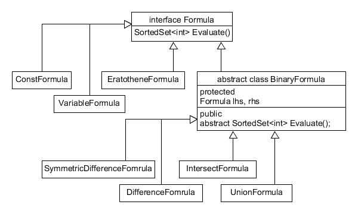
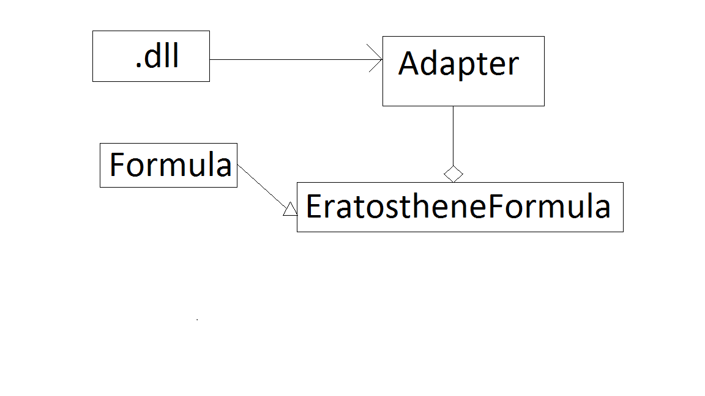

# Проект "Калькулятор множеств"

Данный проект позволяет производить простейшие операции над конечными
множествами целых чисел. Сдери таких операций пересечение, объединение,
разность множеств, симметрическая разность. Кроме того данных калькулятор 
позволяет отсеивать из множества составные числа. Для отсеивания 
используется алгоритм Эратосфена, поэтому при выполнении этой операции
необходимо указывать верхнюю границу отсеивания.

# Архитектура

Программа состоит из двух проектов: основного и библиотеки dll.
В библиотеке содержится реализация алгоритма решета Эратосфена.
Основная программа содержит логику операций и графический интерфейс.

## Иерархия формул

Классы формул реализуют паттерн декоратор, что позволяет хранить структуру 
и легко строить новые формулы из уже готовых. Корневым классом ялвятеся
интерфейс Formula. Он предоставляет единственный метод - Evaluate, который
возвращает множество целых чисел. Для удобства формулы, у которых и левый
и правый аргумент ялвяются формулами, наследуют абстрактный класс
BinaryFormula.

## Адаптер

Для того чтобы использовать алгоритм Эратосфена из внешней библиотеки,
необходимо использовать паттерн адаптер. Адаптером в нашем случае
выступает класс EratotheneFormula, который использует класс 
EratosthenesSieveSet, предоставляемый dll библиотекой, для осуществления
отсева составных чисел.

# Участники

Мирзоев Денис
+ Реализация пользовательского интерфейса
+ Реализация иерархии формул
+ Описание проекта
+ Юнит тестирование

Дядичко Дмитрий
+ Реализация алгоритми решета Эратосфена
+ Написание адаптера для dll библиотеки
+ Создание UML диаграммы
